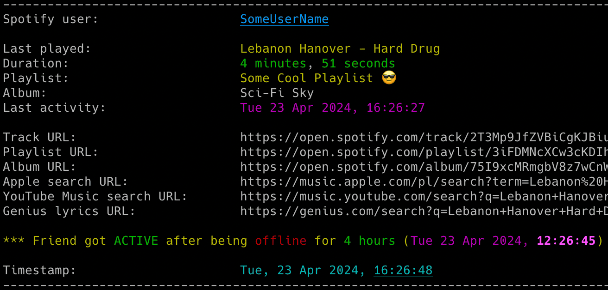
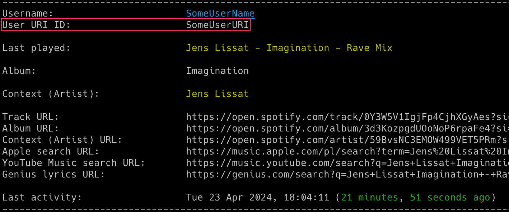
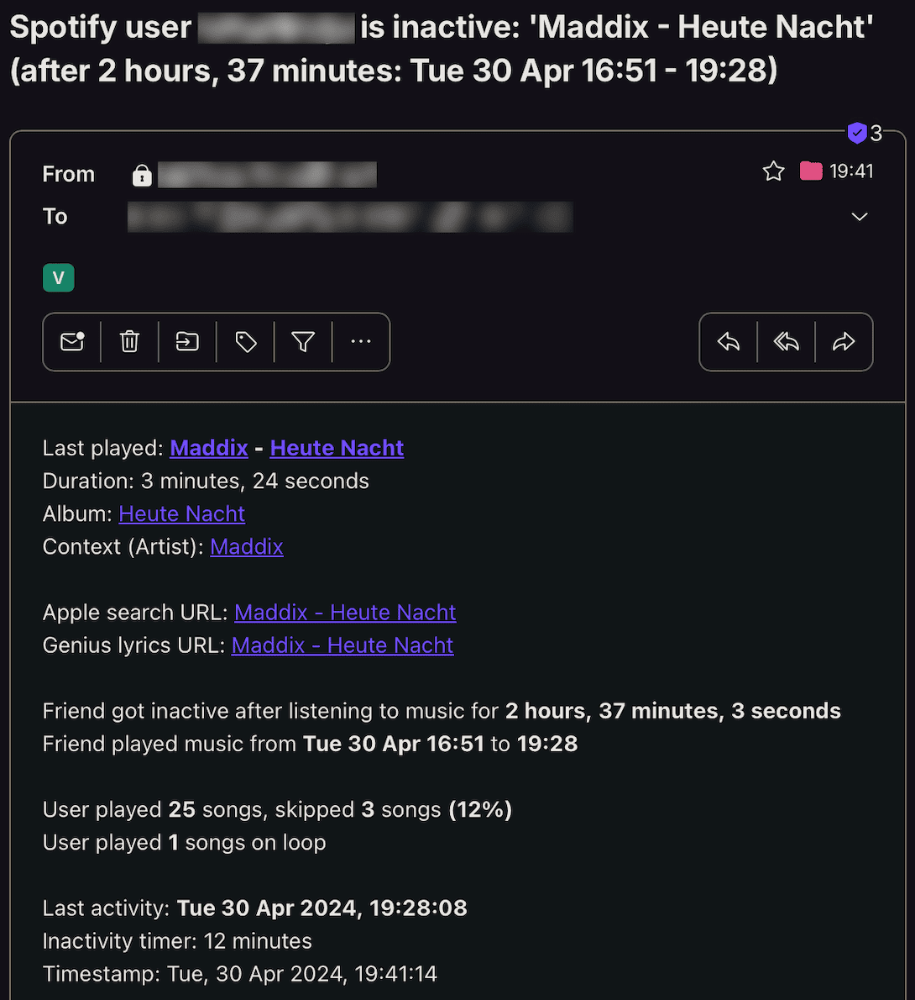

# spotify_monitor

spotify_monitor is a tool that allows for real-time monitoring of Spotify friends' music activity.

NOTE: If you're interested in tracking changes to Spotify users' profiles, take a look at another tool I've developed: [spotify_profile_monitor](https://github.com/misiektoja/spotify_profile_monitor).

## Features

- Real-time tracking of songs listened by Spotify users (including detection when user gets online & offline)
- Possibility to automatically play songs listened by the tracked user in your local Spotify client
- Information about the duration the user listened to a song and whether the song was skipped
- Information about the context of the listened song (playlist/artist/album) with clickable URLs
- Email notifications for various events (user becomes active/inactive, specific or all songs, songs on loop, errors)
- Saving all listened songs with timestamps to the CSV file
- Clickable Spotify, Apple Music, YouTube Music and Genius Lyrics search URLs printed in the console & included in email notifications
- Displaying basic statistics for the user's playing session (duration, time span, number of listened and skipped songs, songs on loop)
- Possibility to control the running copy of the script via signals

<p align="center">
   
</p>

## Change Log

Release notes can be found [here](RELEASE_NOTES.md)

## Requirements

The script requires Python 3.x.

It uses requests, python-dateutil, urllib3 and pyotp.

It has been tested successfully on:
- macOS (Ventura, Sonoma & Sequoia)
- Linux:
   - Raspberry Pi OS (Bullseye & Bookworm)
   - Ubuntu 24
   - Rocky Linux (8.x, 9.x)
   - Kali Linux (2024, 2025)
- Windows (10 & 11)

It should work on other versions of macOS, Linux, Unix and Windows as well.

## Installation

Install the required Python packages:

```sh
python3 -m pip install requests python-dateutil urllib3 pyotp
```

Or from requirements.txt:

```sh
pip3 install -r requirements.txt
```

Copy the *[spotify_monitor.py](spotify_monitor.py)* file to the desired location. 

You might want to add executable rights if on Linux/Unix/macOS:

```sh
chmod a+x spotify_monitor.py
```

## Configuration

Edit the *[spotify_monitor.py](spotify_monitor.py)* file and change any desired configuration variables in the marked **CONFIGURATION SECTION** (all parameters have detailed description in the comments).

### Spotify sp_dc cookie

Log in to the Spotify web client [https://open.spotify.com/](https://open.spotify.com/) in your web browser and copy the value of the sp_dc cookie to the **SP_DC_COOKIE** variable (or use the **-u** parameter).

You can use Cookie-Editor by cgagnier to obtain it easily (available for all major web browsers): [https://cookie-editor.com/](https://cookie-editor.com/)

Newly generated Spotify's sp_dc cookie should be valid for 1 year. You will be informed by the tool once the cookie expires (proper message on the console and in email if error notifications have not been disabled via the **-e** parameter).

It is recommended to create a new Spotify account for use with the tool since we are not using the official Spotify Web API most of the time (as it does not support fetching friend activity).

### Following the monitored user

You need to follow the user you want to monitor from the account from which you obtained the sp_dc cookie. 

Your friend needs to have sharing of listening activity enabled in their Spotify client.

### SMTP settings

If you want to use email notifications functionality you need to change the SMTP settings (host, port, user, password, sender, recipient) in the *[spotify_monitor.py](spotify_monitor.py)* file. If you leave the default settings then no notifications will be sent.

You can verify if your SMTP settings are correct by using **-z** parameter (the tool will try to send a test email notification):

```sh
./spotify_monitor.py -z
```

### Other settings

All other variables can be left at their defaults, but feel free to experiment with it.

## Getting started

### How to get friend's user URI ID

The easiest way is to use your Spotify client. Go to the profile page of your friend and then click 3 dots and select *'Copy link to profile'*. For example: [https://open.spotify.com/user/spotify_user_uri_id?si=tracking_id](https://open.spotify.com/user/spotify_user_uri_id?si=tracking_id)

Then use the string after */user/* and before *?si=tracking_id* (*spotify_user_uri_id* in the example) as your friend URI ID.

You can also easily obtain user URI IDs for all the friends you follow by using [Listing mode](#listing-mode).

### List of supported parameters

To get the list of all supported parameters:

```sh
./spotify_monitor.py -h
```

or 

```sh
python3 ./spotify_monitor.py -h
```

### Monitoring mode

To monitor specific user activity, just type Spotify user URI ID as parameter (**spotify_user_uri_id** in the example below):

```sh
./spotify_monitor.py spotify_user_uri_id
```

If you have not changed **SP_DC_COOKIE** variable in the *[spotify_monitor.py](spotify_monitor.py)* file, you can use **-u** parameter:

```sh
./spotify_monitor.py spotify_user_uri_id -u "your_sp_dc_cookie_value"
```

The tool will run indefinitely and monitor the user until the script is interrupted (Ctrl+C) or terminated by other means.

You can monitor multiple Spotify friends by running multiple copies of the script.

It is recommended to use something like **tmux** or **screen** to keep the script running after you log out from the server (unless you are running it on your desktop).

The tool automatically saves its output to *spotify_monitor_{user_uri_id}.log* file (the log file name suffix can be changed via **-y** parameter or logging can be disabled completely with **-d** parameter).

Keep in mind that monitoring reports the listened track AFTER the user finishes listening to it. This is how activities are reported by Spotify.

### Listing mode

There is another mode of the tool that prints a list of all the friends you follow with their recently listened tracks (**-l** parameter):

```sh
./spotify_monitor.py -l
```

It also displays your friend's Spotify username (often the user's first and last name) and user URI ID (often a string of random characters). The latter should be used as a tool's parameter to monitor the user.

<p align="center">
   
</p>

You can use the **-l** functionality regardless of whether the monitoring is used or not (it does not interfere).

## How to use other features

### Email notifications

If you want to receive email notifications when a user becomes active (**-a** parameter) and inactive (**-i** parameter):

```sh
./spotify_monitor.py spotify_user_uri_id -a -i
```

Make sure you defined your SMTP settings earlier (see [SMTP settings](#smtp-settings)).

Example email:

<p align="center">
   
</p>

If you also want to be notified every time a user listens to specific songs, you can use the **track_notification** functionality (**-t** parameter).

To do this, you need to create a file with a list of songs you want to track (one track/album/playlist per line). The file must be specified using the **-s** parameter. The script checks if the listened track, album or playlist is in the file. Example file *spotify_tracks_spotify_user_uri_id*:

```
we fell in love in october
Like a Stone
Half Believing
Something Changed
I Will Be There
```

Then run the tool with **-t** and **-s** parameters:

```sh
./spotify_monitor.py spotify_user_uri_id -t -s ./spotify_tracks_spotify_user_uri_id
```

If you want to receive email notifications for every song listened by the user, use the **-j** parameter.

```sh
./spotify_monitor.py spotify_user_uri_id -j
```

If you want to receive email notifications when a user listens to the same song on loop, use the **-x** parameter.

```sh
./spotify_monitor.py spotify_user_uri_id -x
```

### Saving listened songs to the CSV file

If you want to save all listened songs in the CSV file, use **-b** parameter with the name of the file (it will be automatically created if it does not exist):

```sh
./spotify_monitor.py spotify_user_uri_id -b spotify_tracks_spotify_user_uri_id.csv
```

### Automatic playback of tracks listened to by the user in the Spotify client

If you want the tool to automatically play the tracks listened to by the user in your local Spotify client, use the **-g** parameter:

```sh
./spotify_monitor.py spotify_user_uri_id -g
```

Your Spotify client needs to be installed and started for this feature to work.

The script has full support for playing songs listened to by the tracked user under **Linux** and **macOS**. This means it will automatically play the changed track and can also pause or play the indicated track once the user becomes inactive (see the **SP_USER_GOT_OFFLINE_TRACK_ID** variable).

For **Windows**, it works in a semi-automatic way: if you have the Spotify client running and you are not listening to any song, then the first song will be played automatically. However, for other tracks, it will only search and indicate the changed track in the Spotify client, but you need to press the play button manually. I have not found a better way to handle this locally on Windows yet without using the remote Spotify Web API.

You can change the method used for playing the songs under Linux, macOS and Windows by changing the respective variables in the *[spotify_monitor.py](spotify_monitor.py)* file.

For **macOS** change **SPOTIFY_MACOS_PLAYING_METHOD** variable to one of the following values:
-  "**apple-script**" (recommended, **default**)
-  "trigger-url"

For **Linux** change **SPOTIFY_LINUX_PLAYING_METHOD** variable to one of the following values:
- "**dbus-send**" (most common one, **default**)
- "qdbus"
- "trigger-url"

For **Windows** change **SPOTIFY_WINDOWS_PLAYING_METHOD** variable to one of the following values:
- "**start-uri**" (recommended, **default**)
- "spotify-cmd"
- "trigger-url"

The recommended defaults should work for most people.

Keep in mind that monitoring reports the listened track after the user finishes listening to it. This is how activities are reported by Spotify. It means you will be one song behind the monitored user and if the song currently listened to by the tracked user is longer than the previous one, then the previously listened song might be played in your Spotify client on repeat (and if shorter it might be changed in the middle of the currently played song).

If you want to have fully real-time monitoring of a user's music activity, ask your friend to connect their Spotify account with [Last.fm](https://www.last.fm/) and then use the other tool I developed: [lastfm_monitor](https://github.com/misiektoja/lastfm_monitor).

### Check intervals and offline timer 

If you want to change the check interval to 20 seconds, use the **-c** parameter.

```sh
./spotify_monitor.py spotify_user_uri_id -c 20
```

If you want to change the time required to mark the user as inactive to 15 minutes (900 seconds) use the **-o** parameter (the timer starts from the last reported track):

```sh
./spotify_monitor.py spotify_user_uri_id -o 900
```

### Controlling the script via signals (only macOS/Linux/Unix)

The tool has several signal handlers implemented which allow changing the behavior of the tool without needing to restart it with new parameters.

List of supported signals:

| Signal | Description |
| ----------- | ----------- |
| USR1 | Toggle email notifications when user gets active/inactive (-a, -i) |
| USR2 | Toggle email notifications for every song (-j) |
| CONT | Toggle email notifications for tracked songs (-t) |
| PIPE | Toggle email notifications when user plays song on loop (-x) |
| TRAP | Increase the inactivity check timer (by 30 seconds) (-o) |
| ABRT | Decrease the inactivity check timer (by 30 seconds) (-o) |

So if you want to change the functionality of the running tool, just send the appropriate signal to the desired copy of the script.

I personally use the **pkill** tool. For example, to toggle email notifications for each listened song for the tool instance monitoring the *spotify_user_uri_id* user:

```sh
pkill -f -USR2 "python3 ./spotify_monitor.py spotify_user_uri_id"
```

As Windows supports limited number of signals, this functionality is available only on Linux/Unix/macOS.

### Other

Check other supported parameters using **-h**.

You can combine all the parameters mentioned earlier in monitoring mode (listing mode only supports **-l**).

## Coloring log output with GRC

If you use [GRC](https://github.com/garabik/grc) and want to have the tool's log output properly colored you can use the configuration file available [here](grc/conf.monitor_logs)

Change your grc configuration (typically *.grc/grc.conf*) and add this part:

```
# monitoring log file
.*_monitor_.*\.log
conf.monitor_logs
```

Now copy the *conf.monitor_logs* to your *.grc* directory and spotify_monitor log files should be nicely colored when using *grc* tool.

## License

This project is licensed under the GPLv3 - see the [LICENSE](LICENSE) file for details
